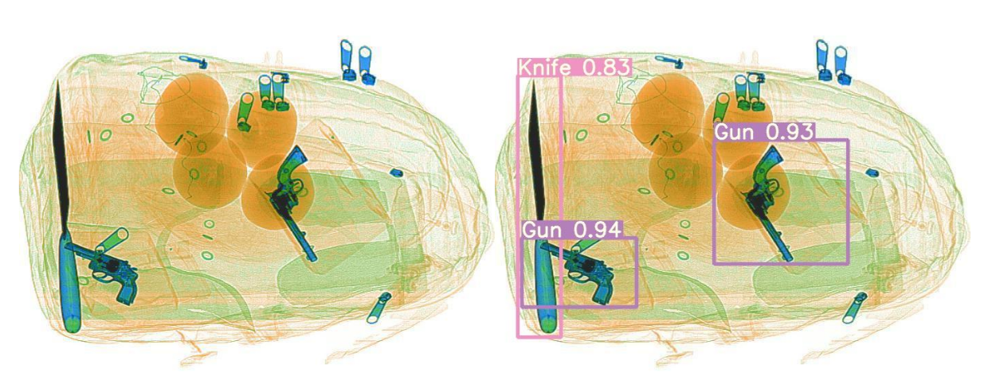

# Лабораторная работа №3

## Цель работы

Изучить основы реализации глубоких нейронных сетей на мобильных
системах, а также методы их оптимизации.

## Задание

1. Изучить принципы построения глубоких нейронных сетей, их разновидности, архитектуры (применительно к обработке
   изображений и видео).
2. Изучить способы реализации нейросетевых вычислений (CPU, GPU).
3. Реализовать систему обработки изображений на основе нейронной
сети (назначение и архитектуру сети выбрать самостоятельно, это
может быть предобученная сеть для детектирования объектов,
сегментации, классификации, построения карты глубины, вычисления
оптического потока). Реализация обучения сети не требуется.
Приложение должно принимать на вход реальное изображение
(изображения) и выводить результат (обработанное изображение или
полученную из него информацию, рис. 1).


Рис. 1. Примеры входного и выходного изображений

1. Оптимизировать выбранную сеть с помощью TensorRT.
2. Оценить следующие характеристики:

- Время выполнения программы и количество используемой памяти
при использовании сети без оптимизации.
- Производительность и потребление памяти при использовании
TensorRT.
- Изменение выхода сети (числовых значений) при использовании
TensorRT при одинаковых входных данных.
- Возможность применения реализованной системы в real-time
приложениях.

### Примечение

Измерение скорости выполнения алгоритма должно быть выполнено несколько раз с последующим усреднением для минимизации влияния
степени загруженности вычислительных ресурсов другими процессами.
Отдельно необходимо измерить время загрузки весов сети в память и непосредственно обработки изображений (в потоке).
Можно взять любую архитектуру и задачу, например, ResNet-18 для задачи классификации.

## Теоретическая база

AlexNet - это архитектура сверточной нейронной сети (CNN), которая стала известной благодаря своему выдающемуся результату на соревновании ImageNet Large Scale Visual Recognition Challenge (ILSVRC) в 2012 году. Архитектура была разработана Алексеем Крижевским, Ильей Суцкевером и Джеффри Хинтоном. AlexNet сыграла важную роль, продемонстрировав эффективность глубокого обучения в задачах компьютерного зрения.

Основные характеристики AlexNet:

1. Архитектура:
- AlexNet состоит из пяти сверточных слоев, за которыми следуют три полносвязанных слоя.
- В качестве функций активации используются линейные выпрямители (ReLU).
- После первого и второго сверточных слоев применяется нормализация локального ответа (LRN).
- Применяется максимальное объединение по пространственным измерениям.

2. Размер входных данных:
- AlexNet была разработана для обработки изображений размером 224x224 пикселя.

3. Обучение:
- Сеть обучалась на наборе данных ImageNet, который содержит большое количество изображений из 1000 различных классов.
- Процесс обучения включал в себя использование аугментации данных и метода отсева (dropout) для уменьшения переобучения.

4. Достижения:
- На соревновании ILSVRC 2012 AlexNet значительно превзошла другие подходы, существенно снизив показатель ошибок топ-5.

5. Влияние на глубокое обучение:
- AlexNet считается одной из первых моделей, которая способствовала возрождению интереса к глубокому обучению.
- Ее успех продемонстрировал эффективность глубоких нейронных сетей в задачах классификации изображений.
- С момента представления AlexNet произошло множество новых разработок в области архитектур глубокого обучения, но она остается важным этапом в области компьютерного зрения и сверточных нейронных сетей.

Для выполнеия использовались библиотеки torch, torchvision и torch2trt.

### Функция по обработке изображений

```python
def image_processing(images: list,
                   trt: bool):
    times = time.time()
    if trt:
        x = torch.ones((1, 3, 224, 224)).cuda()
        model = alexnet(pretrained=True).eval().cuda()
        model_trt = torch2trt(model, [x])
        torch.save(model_trt.state_dict(), 'alexnet_trt.pth')
        model = TRTModule()
        model.load_state_dict(torch.load('alexnet_trt.pth'))
    else:
        model = alexnet(pretrained=True).eval().cuda()
    print("Model load time {}".format(time.time() - times))

    times = time.time()
    for image in images:
        index = image_classification(image, model)
        output_text = str(index) + ': ' + classes[index]
        edit = ImageDraw.Draw(image)
        edit.rectangle((0, image.height - 20, image.width, image.height),
                       fill=(255, 255, 255))
        edit.text((50, image.height-15), output_text, (0, 0, 0),
                  font=ImageFont.load_default())
        image.save('./output/' + image.filename.split('/')[-1])
    print(images)
    print("Image(s) processing time {}".format(time.time() - times))
    print('Memory allocated: ' + str(torch.cuda.memory_allocated()))
    print('Max memory allocated: ' + str(torch.cuda.max_memory_allocated()))
```

#### Функция по классификация изображений

```python
def image_classification(image: Image,
                   model) -> int:
    image_tensor = transform(image).float()
    image_tensor = image_tensor.unsqueeze_(0)
    input = Variable(image_tensor).to(device)

    output = model(input)
    return output.data.cpu().numpy().argmax()
```

#### Основная функция

```python
def main(argv: list,
         trt: bool = False):
    try:
        opts, empty = getopt.getopt(argv, "", ["trt"])
        if len(opts) == 1:
            trt = True
            argv.remove('--trt')
        elif len(opts) > 1:
            raise getopt.GetoptError("is not a directory.")
    except getopt.GetoptError:
        print_usage()
        sys.exit(1)

    for file in glob.glob('data/*.jpg', recursive=True):
        try:
            image = Image.open(file)
            images.append(image)
        except FileNotFoundError:
            print(file + " not found")

    if len(images) == 0:
        print_usage()
        sys.exit(1)

    image_processing(images, trt)
```

## Результаты работы и тестирования системы

Таблица результатов тестирования модели по классификации 11 изображений:

|        Имя        | Работа модели, сек |  Обработка изображений, сек  | Максимальное количество выделенной памяти, байт |
|:-----------------:|:------------------:|:----------------------------:|:-----------------------------------------------:|
|      Без TRT      |        2.67        |             1.73             |                    266467840                    |
|        TRT        |        70.32       |             0.41             |                    269542400                    |
| TRT (сохраненное состояние) |      4.45         |             0.72             |                      606208                     |


## Исходное изображение 

Рис. 2. Исходное изображение

**Примечание**

   В целой модель без TRT и с TRT при классификации показали идентичные результаты.

## Вывод

Загрузка готовой модели прошла легко, поскольку веса и сама модель уже включены в библиотеку torchvision. Результаты тестирования также подтвердили, что обработка одного кадра с использованием TensorRT в 9-10 раз быстрее по сравнению с обработкой аналогичной модели без TensorRT, при этом потребление памяти значительно уменьшилось.

## Использованные источники

#### [Документация Torch](https://pytorch.org/docs/stable/index.html)

#### [Документация Torchvision](https://pytorch.org/vision/stable/index.html)

#### [Документация Torch2trt](https://github.com/NVIDIA-AI-IOT/torch2trt)
